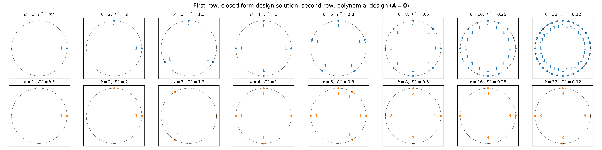

# spectraldesign

A Python package for spectral design.

## Development Setup

### Install in development mode

Create and activate a virtual environment:

```
python -m venv .venv
source .venv/bin/activate  # On Windows: .venv\\Scripts\\activate
```

Then install the package with development dependencies:

```bash
pip install -e ".[dev]"
```

### Running Tests

To run the test suite, use:

```bash
pytest
```

## Examples

## Example: No-prior designs in 2D

The figure below, `no_prior_designs.png`, visualizes the designs for several values of `k`.



For each subplot:

- The dashed circle is the unit circle in $\mathbb{R}^2$.
- The plots in the first row are obtained with the closed form solutions.
- The plots in the second row are obtained with the polynomal time algorithm.
- The muliplicity of the dots (columns of the design matrix) are indicated by the numbers
  next to them.
- $F^*$ stands for $\mathrm{Tr}((\boldsymbol{X} \boldsymbol{X}^\top)^{-1})$ is minimized for the zero prior $\boldsymbol{A} = \boldsymbol{0}$.

You can regenerate the figure by running:

```bash
cd examples
python ./no_prior_design.py
```

### Code Quality

Check code style and formatting:

```bash
ruff check .
ruff format --check .
```

Auto-format code:

```bash
ruff format .
```

## Project Structure

```
spectraldesign/
├── src/
│   └── spectraldesign/     # Package source code
│       └── __init__.py
├── tests/                  # Test suite
│   ├── __init__.py
│   └── test_basic.py
├── .github/
│   └── workflows/          # CI/CD workflows
│       ├── test.yml        # Run tests on multiple Python versions
│       └── lint.yml        # Code quality checks
├── pyproject.toml          # Package configuration
├── README.md
└── LICENSE
```

## Continuous Integration

This project uses GitHub Actions for continuous integration:

- **Tests**: Automatically run on Python 3.8-3.12 on push and pull requests
- **Linting**: Code quality checks with ruff on push and pull requests
