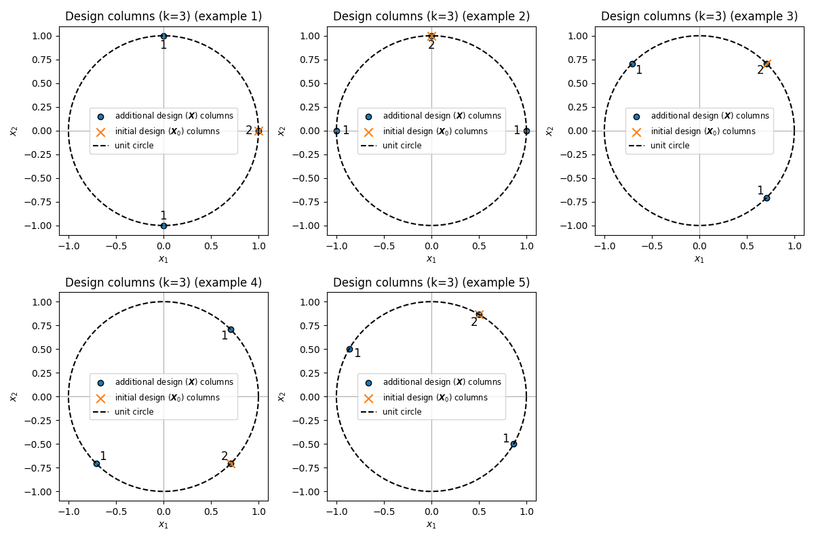
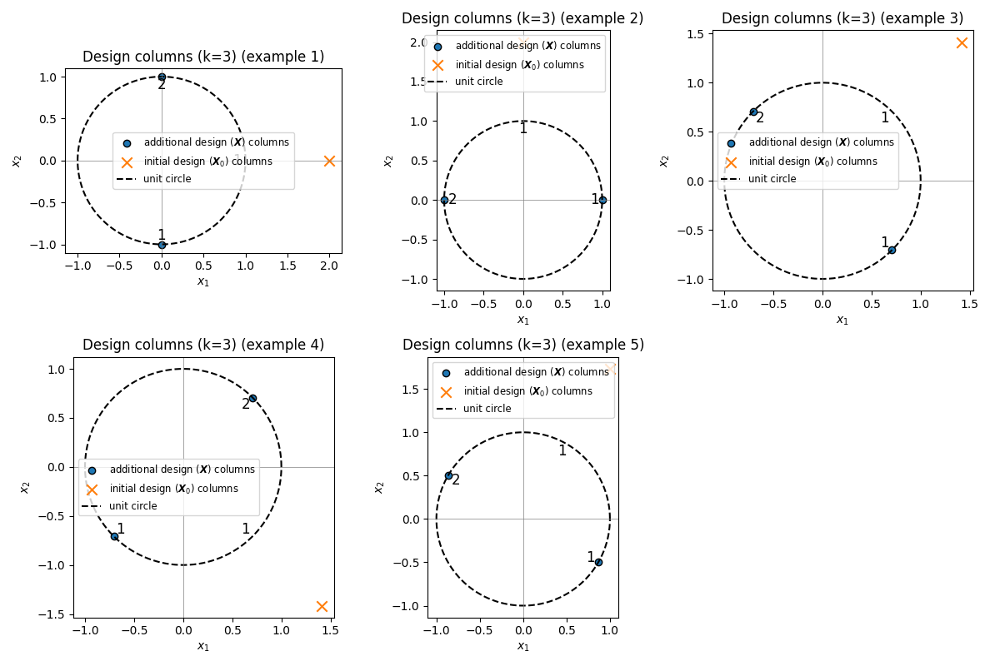

# spectraldesign

A Python package for spectral design.

## Development Setup

### Install in development mode

Create and activate a virtual environment:

```
python -m venv .venv
source .venv/bin/activate  # On Windows: .venv\\Scripts\\activate
```

Then install the package with development dependencies:

```bash
pip install -e ".[dev]"
```

### Running Tests

To run the test suite, use:

```bash
pytest
```

## Examples

## Example: No-prior designs in 2D

The figure below, `no_prior_designs.png`, visualizes the designs for several values of `k`.


For each subplot:

- The dashed circle is the unit circle in $\mathbb{R}^2$.
- The plots in the first row are obtained with the closed form solutions.
- The plots in the second row are obtained with the polynomal time algorithm.
- The muliplicity of the dots (columns of the design matrix) are indicated by the numbers
  next to them.
- $F^*$ (optimal value). More precisely, it evaluates $\mathrm{Tr}((\boldsymbol{X} \boldsymbol{X}^\top)^{-1})$
for the optimal design matrix $\boldsymbol{X} \in \mathbb{R}^{2 \times k}$.

You can regenerate the figure by running:

```bash
cd examples
python ./no_prior_design.py
```

## Example: One-prior design experiment

The figures `one_prior_design_examples.png` and `one_prior_design_scaled.png`
illustrate a single application: optimal design in the presence of a fixed
(nonzero) prior matrix $\boldsymbol{A} = \boldsymbol{X}_0 \boldsymbol{X}_0^top$.

In this experiment:

- We fix a prior covariance (or information) matrix $\boldsymbol{X}_0 \in \mathbb{R}^{2}$.
- For several budgets $k$, we compute a design matrix
  $\boldsymbol{X} \in \mathbb{R}^{2 \times k}$.
- Each subplot shows the columns of $\boldsymbol{X}$ (points in the unit disk) 
  and those of $\boldsymbol{X}_0$ 

We consider figure



where the prior vector $\boldsymbol{X}_0$ has unit norm, and



where the prior vector $\boldsymbol{X}_0$ has norm $2$. Both figures show, for each choice $k$:

- The vector $\boldsymbol{X}_0$.
- The optimized design points (columns of $\boldsymbol{X}$).

### Reproducing the one-prior experiment

You can regenerate the plots by running from the project root:

```bash
cd examples
python ./one_prior_design.py
```

which will produce:

- `examples/one_prior_design_examples.png`
- `examples/one_prior_design_scaled.png`

### Code Quality

Check code style and formatting:

```bash
ruff check .
ruff format --check .
```

Auto-format code:

```bash
ruff format .
```

## Project Structure

```
spectraldesign/
├── src/
│   └── spectraldesign/     # Package source code
│       └── __init__.py
├── tests/                  # Test suite
│   ├── __init__.py
│   └── test_basic.py
├── .github/
│   └── workflows/          # CI/CD workflows
│       ├── test.yml        # Run tests on multiple Python versions
│       └── lint.yml        # Code quality checks
├── pyproject.toml          # Package configuration
├── README.md
└── LICENSE
```

## Continuous Integration

This project uses GitHub Actions for continuous integration:

- **Tests**: Automatically run on Python 3.8-3.12 on push and pull requests
- **Linting**: Code quality checks with ruff on push and pull requests
